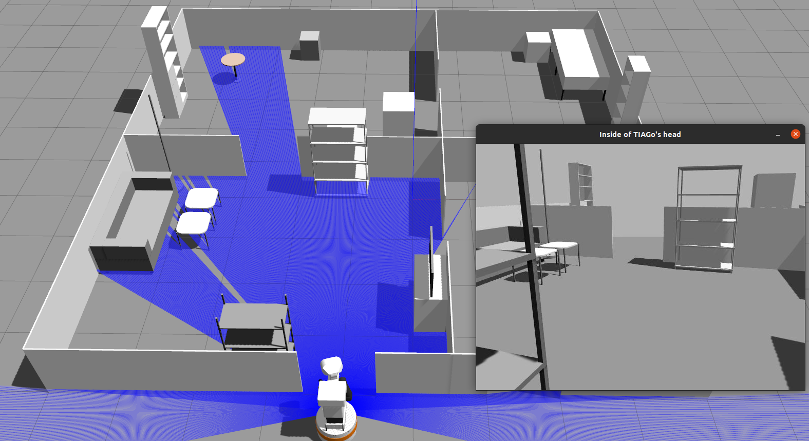

# tiago-sim



## Dependencies
 - [Docker](https://www.docker.com/)
 - [Base Image](https://github.com/Maik13579/ros-docker-base-image/tree/master)

## Build
### ROS1 Noetic
```bash
docker-compose -f docker/build.yml build ros
```
## Getting started
### ROS1 Noetic
```bash
docker-compose -f docker/ros/docker-compose.yml up
```

## Authors
 - Maik Knof (maik.knof@gmx.de)
